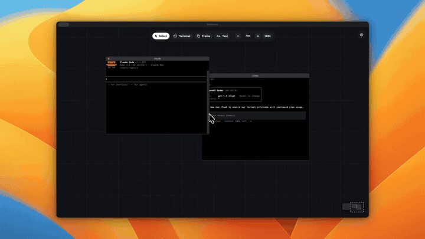

<p align="center">
  
</p>
<h1 align="center">Fmux</h1>
<p align="center">Floating terminals for agent work.</p>

[](docs/assets/fmux-1.mp4)

A native macOS canvas with movable terminals, session frames, persistent shells, and broadcast input.

## Install

Requires macOS 14+ and Xcode 16 or a Swift 6 toolchain.

```bash
git clone https://github.com/RaghuvirSingh23/fmux.git
cd fmux
make install
```

This installs `/Applications/fmux.app` and opens it. Use `make run` to build and open a local copy from `dist/`.
